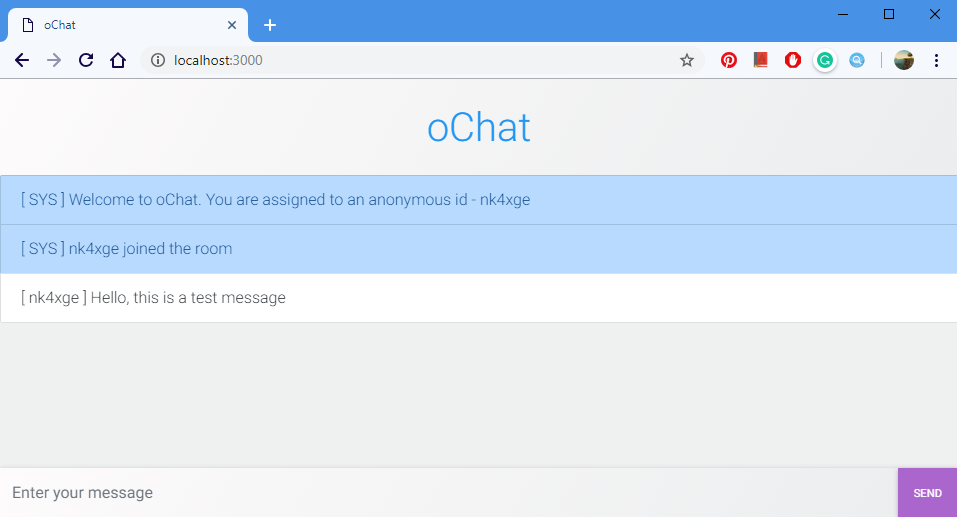
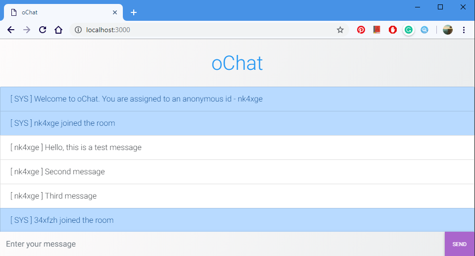
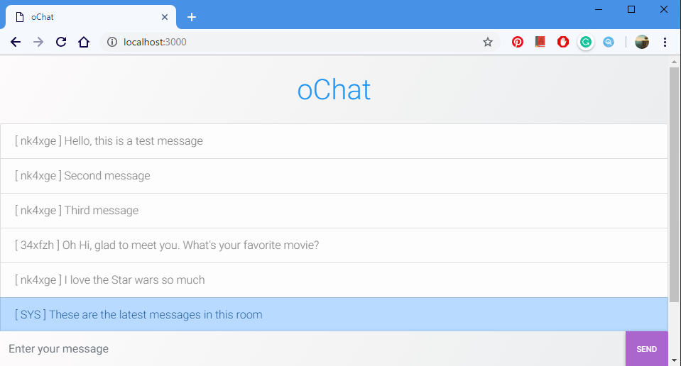

# oChat
A web-based chat room nodejs application, using express and socket.io
<br><br><br>

> Transfered from the old account by Dec 17, 2019 EST.

## Features
Three types of message in different colours

<br><br>
New user is automatically assigned to an random id while entering the chat room

<br><br>
New users joining the chat will be broadcasted to all users in the room

<br><br>
History messages will be displayed to new users

<br><br><br>

## How to use
Install
```
npm install
```

Run
```
npm start
```
<br><br>

## License
Licensed under the [MIT License](LICENSE).
